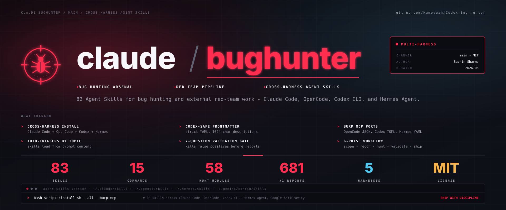

# Codex-Bug-hunter

Codex-first Agent Skills and deterministic tooling for authorized bug-bounty,
web application security, recon, validation, and external red-team work.

This distribution contains **84 skills**, a `$bughunter` workflow router, the
`cbh` command-line runner, guarded engagement workflows, and optional Burp MCP
integration. It also retains **15 slash commands** for Claude Code compatibility.
It is designed to work immediately after a clone and Codex-only installation.

> Use this project only on assets you own or have explicit permission to test.
> Recon results never expand the authorized scope automatically, and
> state-changing proof-of-concept actions require operator approval.

This repository is maintained at
[`Hamoyeah/Codex-Bug-hunter`](https://github.com/Hamoyeah/Codex-Bug-hunter).
It is based on
[`elementalsouls/Claude-BugHunter`](https://github.com/elementalsouls/Claude-BugHunter);
upstream authorship, licenses, and content attribution are preserved.

## Quick start with Codex

### Windows PowerShell

```powershell
git clone https://github.com/Hamoyeah/Codex-Bug-hunter.git
cd Codex-Bug-hunter
powershell -ExecutionPolicy Bypass -File .\scripts\install.ps1 -CodexOnly
```

### macOS or Linux

```bash
git clone https://github.com/Hamoyeah/Codex-Bug-hunter.git
cd Codex-Bug-hunter
bash scripts/install.sh --codex-only
```

Start a new Codex thread after installation so the skill index is refreshed.
Then invoke the router explicitly:

```text
$bughunter recon example.com
$bughunter hunt example.com
$bughunter triage
$bughunter report
```

You can also ask naturally:

```text
I am authorized to test example.com. Map the attack surface, remain inside
that exact scope, and rank the most promising areas for manual review.
```

The Codex-only installer copies the skills to `~/.agents/skills`, does not write
to `~/.claude`, and does not modify your shell profile.

## What is included

| Component | Purpose |
|---|---|
| `skills/bughunter` | Codex workflow router for recon, hunt, validation, reporting, and memory operations |
| `skills/hunt-*` | Vulnerability-class and framework-specific testing guidance |
| `skills/web2-recon` | Scope-aware web reconnaissance workflow |
| `cbh` | Deterministic terminal runner for recon, classification, triage, and reports |
| `engine` | Resumable engagement orchestration and provider-aware LLM dispatch |
| `commands` | Legacy Claude Code slash-command compatibility layer |
| `.codex-plugin` | Codex plugin metadata |

The skill set includes **58 `hunt-*` skills** and covers recon and OSINT,
common web vulnerability classes, GraphQL, OAuth, JWT, cloud and enterprise
perimeter review, evidence hygiene, validation gates, and platform-aware reporting. See the
[skill catalog](docs/skills.md) for the complete list.

## `cbh` command-line runner

Install the CLI directly from the repository:

```bash
pipx install git+https://github.com/Hamoyeah/Codex-Bug-hunter.git
```

Examples:

```bash
cbh recon example.com
cbh surface example.com
cbh triage
```

The CLI is deterministic and can be used without an LLM. Optional tools such
as `subfinder`, `httpx`, `katana`, `gau`, and Burp improve coverage when they
are installed, but the core workflow degrades gracefully when they are absent.

See [`docs/cbh-cli.md`](docs/cbh-cli.md) for commands and output formats.

## Optional Burp MCP integration

If Burp Suite and its MCP server extension are already installed, register the
server with Codex:

```bash
codex mcp add burp -- java -jar /path/to/mcp-proxy-all.jar
codex mcp list
```

Burp is optional. Direct, scope-checked HTTP requests and the deterministic CLI
remain available without it. Never commit cookies, tokens, raw HAR files, or
unredacted screenshots.

## Other agent runtimes

Codex is the primary supported experience. The underlying `SKILL.md` files use
the portable Agent Skills format, and the installers retain optional support
for Claude Code, OpenCode, Hermes Agent, and Google AntiGravity.

```bash
bash scripts/install.sh --all
```

```powershell
pwsh ./scripts/install.ps1 -All
```

Claude Code users can still use the compatibility plugin and slash commands,
but those are not required for Codex. See
[`docs/multi-harness.md`](docs/multi-harness.md) for the compatibility matrix.

## Project layout

```text
Codex-Bug-hunter/
|-- skills/                 Agent Skills, including the BugHunter router
|-- engine/                 Engagement engine and recon pipeline
|-- cbh/                    Terminal CLI package
|-- commands/               Claude Code compatibility commands
|-- scripts/                Installers, validators, and helper scripts
|-- docs/                   Architecture and operator documentation
|-- .codex-plugin/          Codex plugin manifest
`-- AGENTS.md               Repository-level Codex instructions
```

## Safety model

- Establish an explicit allowlist before active requests.
- Deny rules always take precedence over allow rules.
- Re-check scope after redirects and before each new tool action.
- Do not treat discovered hosts as authorized automatically.
- Keep destructive, state-changing, or high-volume actions behind explicit
  operator approval.
- Never submit reports automatically.
- Redact credentials, session material, personal data, and raw evidence before
  sharing it.

Read [`SECURITY.md`](SECURITY.md) before using the project against a live
target.

## Documentation

- [Installation guide](INSTALL.md)
- [Usage guide](USAGE.md)
- [Architecture](docs/architecture.md)
- [Skill catalog](docs/skills.md)
- [`cbh` CLI](docs/cbh-cli.md)
- [Recon manifest](docs/recon-manifest.md)
- [Contributing](CONTRIBUTING.md)

## Attribution and license

The Codex adaptation is derived from Claude-BugHunter by Sachin Sharma
([ElementalSoul](https://github.com/elementalsouls)). Vendored and
community-derived material is documented in [`NOTICE`](NOTICE) and
[`docs/credits.md`](docs/credits.md).

- Source code is licensed under the [MIT License](LICENSE).
- Documentation and methodology content are licensed under
  [CC BY 4.0](LICENSE-CONTENT).

When redistributing the content, retain the required upstream attribution and
license notices.
